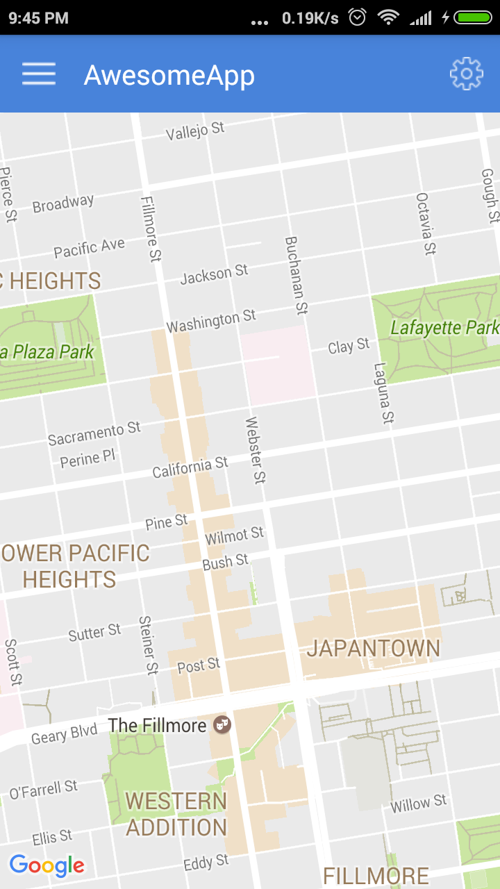

This is a quick starter for react native with useful libraries. It includes templates for following libraries:

- Airbnb react-native-map
- React navigation (http://reactnavigation.org)
- react-redux (http://redux.js.org/docs/introduction/)
- shoutem-ui toolkit (http://shoutem.github.io/docs/ui-toolkit/introduction)
- vector icons (https://github.com/oblador/react-native-vector-icons)
- node/express api server
- Login with facebook (https://developers.facebook.com/docs/react-native/login)


The starter is mainly tested on Android, but it should work fine on ios also (please raise an  issue if you find any problem on ios).

## Installation

The pre requisite to make this template useful is setting up android / ios sdk with corresponding tools. You can use android-studio with sdk-manager to download required build tools.

The next thing you require is installing react-native-cli:
```
npm install -g react-native-cli
```

After that follow the steps below:
```
git clone https://github.com/Eyezon/react-native-map-shoutem-boiler-plate.git
```
```
yarn install
```

Now your application is ready with required libraries. 
In order to use react-native-maps you have to add a valid google map API key in your AndroidManifest.xml file (location: [project-root]/android/app/src/). You should already see the following line in that file. 
`
<meta-data
      android:name="com.google.android.geo.API_KEY"
      android:value="YOUR_API_KEY"/>
`

What you need to do is replace 'YOUR_API_KEY' with a valid google maps API key.

In order to use **login with facebook** you have to add a valid facebook app id in your strings.xml file (location: [project-root]/android/app/src/main/res/values). You should already see the following line in that file. 
`
<resources>
    <string name="app_name">FanLikeYou</string>
    <string name="facebook_app_id">YOUR_FB_APP_ID</string>
</resources>

`
Replace 'YOUR_FB_APP_ID' with a valid facebook app ID. Make sure your facebook app is configured correctly, otherwise **login with facebook** feature will not work.

Open a shell prompt and run the api server by entering the following command.

```
node server/server.js
```

Finally, build and run the project either on emujlator or on a physical device through USB debugging.

```
react-native run-android
```

After the build is finished, run the following command to setup dev server.

```
react-native start
```





